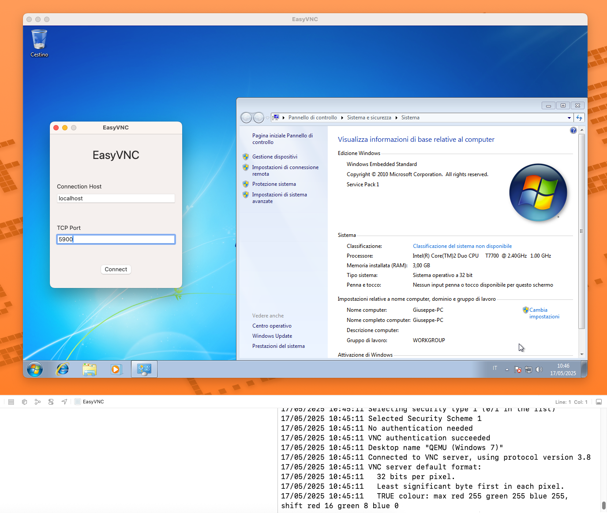

# EasyVNC

**EasyVNC** is a minimal VNC client built in **SwiftUI**, leveraging `libvncclient` from [LibVNCServer](https://github.com/LibVNC/libvncserver) via an Objective-C++ wrapper.

The goal of this project is to provide a lightweight, native macOS VNC viewer with essential functionality and a clean SwiftUI interface.



## 🚀 Features

- 🔌 Connect to a VNC server via IP and port
- 🖥️ Render the remote framebuffer in a SwiftUI view
- 🖱️ Send basic mouse events (click and scroll)
- ⌨️ Send basic keyboard inputs
- 🔓 Supports basic **VNC Password** and **plain VeNCrypt**

> [!IMPORTANT]
> VNC is based on a very old protocol. Nowadays it really is not considered safe to expose a VNC server to the internet. Due to this fact, EasyVNC is designed to **not support** encrypted connection with **SSL** or **TLS**. If you want to host a VNC server, my personal recommendation is to expose it behind a modern and secure VPN.

## 📦 Tech Stack

- **SwiftUI** for the user interface
- **Objective-C++** bridge for low-level C integration
- **libvncclient** (from LibVNCServer) for VNC protocol handling
- **CoreGraphics** for framebuffer rendering

## 📋 Requirements

- macOS 13.0+
- Xcode 14.1+
- Dependencies:
  - `libvncclient` (compiled statically)
  - `zlib`
  - `libjpeg` or `libjpeg-turbo`

## 🛠 Build Notes

Make sure to run ```Third-Party/setup-dependencies.sh```, then link the resulting `.a` and headers into your Xcode project

## Privacy

EasyVNC respects your privacy and does not collect, store, or transmit any personal information or user data. The application only connects to the internet if the user wants to access external VNC servers.
